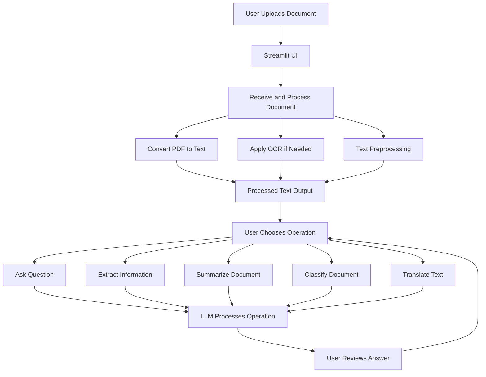

# DoxChat: Document Processing Chatbot

DoxChat is an advanced document processing chatbot that leverages Streamlit for frontend interactions and integrates Optical Character Recognition (OCR) capabilities for processing and analyzing text from various document formats. This application allows users to interact with their documents in real-time, offering functionalities such as question answering, information extraction, content summarization, document classification, and language translation.

## Features

- **Multi-Format Document Upload**: Users can upload PDF, image (JPEG, PNG), and DOCX documents. The application automatically processes all formats.
- **Text Extraction**: Utilizes Tesseract OCR for extracting text from scanned documents within PDFs or images.
- **Text Analysis Operations**:
  - **Ask Questions**: Users can inquire specific information from the document.
  - **Extract Information**: Automatically extract key-pairs data from the text.
  - **Summarize Content**: Generate summaries for quick understanding of document contents.
  - **Classify Documents**: Automatically categorize documents into predefined types.
  - **Translate Text**: Translate text to various languages.
- **LLM Model Selection**: Users can choose between different language models (e.g., GPT, Gemini) for processing their requests.
- **Interactive Chat Interface**: Provides a chat-like interface for users to interact with the chatbot, submit queries, and receive responses in real time.
- **File Switching and Handling**: Supports dynamic switching between different files and ensures seamless processing across multiple document types.

## Architecture

The application is designed with a modular structure for scalability and ease of maintenance:

```
DoxChat/
├── data/
│   └── test_documents/       # Temporary file storage
├── src/
│   ├── api/
│   │   ├── main.py           # API endpoint management
│   │   ├── ocr.py            # OCR functionality
│   │   ├── preprocessing.py  # Text preprocessing
│   │   ├── llm_integration.py# LLM operations
│   │   └── models/           # LLM models
│   │       |── gpt.py  # Model loading and management
|   |       └── gemini.py
│   ├── ui/
│       └── chatbot_ui.py     # Streamlit UI
├── requirements.txt          
└── README.md                 
```

## Libraries Used

- **Streamlit**: For building the interactive user interface.
- **FastAPI**: To handle API requests and manage backend services.
- **Requests**: To handle HTTP requests between the frontend and backend.
- **PDF processing**: Libraries like PyMuPDF and pdfplumber for reading and extracting text from PDF files.
- **OCR Engine**: Tesseract, an open-source OCR tool, for extracting text from scanned document images.

## LLM Models and Libraries

- **GPT-3**: Utilized for various natural language processing tasks such as summarization, question answering, and text classification.
  - **Library**: OpenAI's `openai` library for accessing pre-trained GPT-3 models.

- **Gemini**: Used primarily for generating content and responding to queries with synthesized information.
  - **Library**: Google's `genai` for integrating with Gemini models.

## OCR Engine Selection

Tesseract OCR was chosen for its accuracy, open-source nature, and support for multiple languages, making it ideal for diverse document processing needs.

## Approach and Preprocessing Steps

1. **Document Upload**: Users upload documents through the Streamlit interface. The application supports multiple formats including PDF, images (JPEG, PNG), and DOCX. It automatically converts supported formats to PDF for uniform processing.
2. **Text Extraction**: Depending on the document format, text is extracted using appropriate methods:
   - PDF, DOCX: Direct text extraction.
   - Images: OCR processing for text extraction.
3. **Text Analysis**: Perform various operations on the extracted text, including:
   - Question answering
   - Information extraction
   - Document summarization
   - Document classification
   - Text translation
4. **LLM Model Selection**: Users can select the language model to use for processing text queries, allowing for flexible and powerful document analysis.
5. **User Interaction**: Users interact with the chatbot through a chat-like interface, submitting queries and receiving responses in real time.

## Evaluation Process

- **Accuracy of Text Extraction**: Ensure high accuracy by comparing extracted text with manually processed documents.
- **Response Quality**: Evaluate the quality of the chatbot's responses based on user feedback and automated testing.
- **Performance Metrics**: Measure processing times for document uploads and queries, and application responsiveness.

## Design Choices

- **Chatbot Interface**: Designed to resemble popular chat applications for a user-friendly experience.
- **Modularity**: Functionalities are divided into separate components to facilitate easier maintenance and extension.
- **Scalability**: The backend architecture is designed for potential scalability, supporting future enhancements or migration to microservices.

## Setup

1. Clone the repository:
   ```bash
   git clone <repository-url>
   ```
2. Navigate to the project directory:
   ```bash
   cd DoxChat
   ```
3. Install the dependencies:
   ```bash
   pip install -r requirements.txt
   ```
4. Run the backend server:
   ```bash
   uvicorn src.api:app --reload
   ```
5. Launch the Streamlit app:
   ```bash
   streamlit run src/ui/chatbot_ui.py
   ```

## Flow Diagram



## License

This project is licensed under the MIT License. See the [LICENSE](LICENSE) file for details.