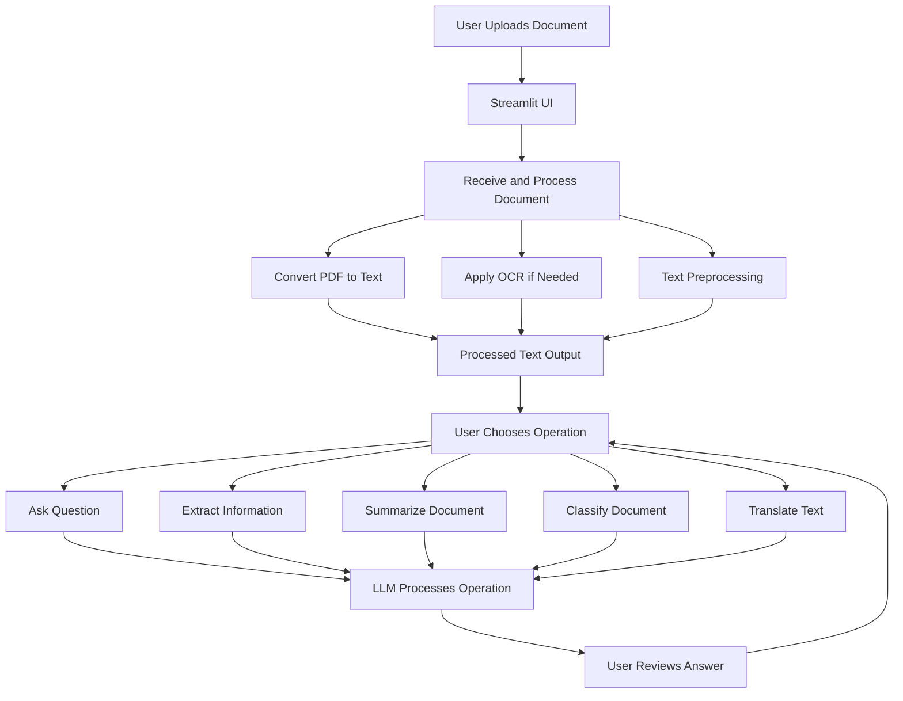

# DoxChat

This project implements a document processing chatbot using Streamlit and integrates OCR (Optical Character Recognition) capabilities to process and analyze text from PDF documents. The chatbot provides functionalities such as asking questions about the document, extracting information, summarizing content, classifying documents, and translating text.

## Directory Structure

```
document_processing_pipeline/
├── data/
│   └── test_documents/       # Temp File Directory
├── src/
│   ├── api/
│   │   ├── main.py           # Driver Code
│   │   ├── ocr.py            # OCR functionality
│   │   ├── preprocessing.py  # Text preprocessing
│   │   ├── llm_integration.py# LLM Operations
│   │   └── models/           # LLM Models
│   │       └── llm_model.py  # Loading and using the LLM
│   ├
│   └── ui/
│       └── chatbot_ui.py     # Streamlit UI
├── requirements.txt          
└── README.md                 
```

## Libraries Used

- **Streamlit**: Provides the frontend interface and interaction components for the application.
- **Requests**: Handles HTTP requests for communicating with the backend services.
- **PDF processing libraries** (e.g., PyMuPDF, pdfplumber): Used for reading and extracting text from PDF documents.
- **OCR Engine**: We use [Tesseract OCR](https://github.com/tesseract-ocr/tesseract), an open-source OCR tool, for extracting text from scanned documents.

## OCR Engine Selection

The choice of Tesseract OCR was based on the following considerations:
- **Accuracy**: Tesseract provides a good balance of accuracy and performance for text extraction tasks.
- **Open Source**: Being open source, Tesseract is freely available and has a large community for support and development.
- **Multi-language Support**: Tesseract supports multiple languages, making it suitable for diverse document processing needs.

## Approach and Preprocessing Steps

1. **Document Upload**: Users can upload PDF documents via the Streamlit interface.
2. **Text Extraction**: The uploaded document is processed to extract text. For scanned images within PDFs, Tesseract OCR is employed to convert images to text.
3. **Text Analysis**: Various operations are performed on the extracted text, including:
   - Asking questions to extract specific information.
   - Summarizing content for quick understanding.
   - Classifying documents into predefined categories.
   - Translating text to different languages.
4. **User Interaction**: Users interact with the chatbot through a chat-like interface, submitting queries or commands, and receiving responses in real-time.

## Evaluation Process

The effectiveness of the OCR and document processing tasks is evaluated based on:
- **Accuracy of Text Extraction**: Verified against manually processed documents to ensure that the extracted text is accurate.
- **Response Quality**: The quality of responses generated by the system is assessed through user feedback and automated testing.
- **Performance Metrics**: Including processing time for document uploads and queries, as well as the responsiveness of the application.

## Design Choices

- **Chatbot Interface**: Inspired by popular chat applications, the chatbot interface in Streamlit provides a user-friendly way for users to interact with the document processing functionalities.
- **Modularity**: The application is designed in a modular way, separating different functionalities into distinct sections and components, making the codebase easier to manage and extend.
- **Scalability**: The application architecture allows for scalability, with the backend services potentially being moved to a more robust environment or microservices architecture as needed.

## Setup

1. Clone the repository: `git clone <repository-url>`
2. Navigate to the project directory: `cd DoxChat`
3. Install the dependencies: `pip install -r requirements.txt`
4. Run the application: `uvicorn src.api:app --reload`
5. Run the application: `streamlit run app.py`

## Flow Digram


## License

This project is licensed under the MIT License - see the [LICENSE](LICENSE) file for details.